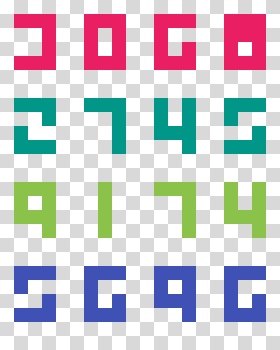

# Welcome to the Pixel Font Challenge

Learn about software development through guided exercises

## Table of contents

- [Setup](#setup)
- [Problem definition](#problem-definition)
- [Requirements](#requirements)
- [How to get started](#how-to-get-started)
- [Solution](#solution)

## Setup

The following tools must be installed on your computer:

- [Java SE Development Kit 11](https://www.oracle.com/technetwork/java/javase/downloads/jdk11-downloads-5066655.html) or higher
- [IntelliJ IDEA: Community Edition](https://www.jetbrains.com/idea/download/)
- [Git](https://git-scm.com/downloads)

Once you're ready:

1. **Clone** this repository
2. Import the project and try to **compile it**
3. If the build is completed successfully, you can start

Make sure Java 11 features enabled:
- *File &gt; Project Structure &gt; Project &gt; Project SDK*
- *File &gt; Project Structure &gt; Project &gt; Project language level*
- *File &gt; Project Structure &gt; Modules &gt; Sources &gt; Language level*

## Problem definition

In a bitmap, a number is composed by digits, and each digit by a group of pixels. For this challenge, a digit is represented in a flat array of 12 slots (3x4). Each pixel can take the value 1 (filled) or 0 (empty).

A digit is something like this:

|Image|ASCII|
|-|-|
| | 1 1 1 <br> 1 0 0 <br> 0 0 1 <br> 1 1 1 |

```java
var digit5 = new Integer[]{ 1, 1, 1, 1, 0, 0, 0, 0, 1, 1, 1, 1 };
```

And a number is an array of digits:

```java
var number5 = new Integer[][]{
    { 1, 1, 1, 1, 0, 0, 0, 0, 1, 1, 1, 1 }
};

var number55 = new Integer[][]{
    { 1, 1, 1, 1, 0, 0, 0, 0, 1, 1, 1, 1 },
    { 1, 1, 1, 1, 0, 0, 0, 0, 1, 1, 1, 1 }
};
```

Your role here is to implement this interface. It receives a number (array of digits) as a parameter and returns which number it is. In case a digit is not recognizable, it will trigger an *NumberFormatException*.

```java
public interface PixelFontParser {

    Integer parseNumber(Integer[][] number) throws NumberFormatException;

}
```

Here you can find some more examples of what is expected of you:



|Color |Value|
|-|-|
|Ruby|3068|
|Emerald|2745|
|Lima|9174|
|Indigo|5696|

## Requirements

Rules to complete this challenge:

- **Only functional programming techniques are allowed**, so you cannot use while/for/do, if/else or switch (++only ternary operator is allowed++)
- **Only one line can be edited**, so you will have to concatenate functional operations (++you can break lines to improve legibility.++)
- **All tests have to pass**

## How to get started

Follow the steps below:

1. Make sure you **understand** the problem
2. Read and **analyze** the tests
3. **Research** about Java Stream API (map, reduce, IntStream, Optional, etc.)
4. **Implement** your solution in [PixelFontParserImpl](https://github.com/joseluisluri/pixelfont-challenge/blob/master/src/main/java/PixelFontParserImpl.java)

## Solution

You can find a possible solution in the branch called "solved".
